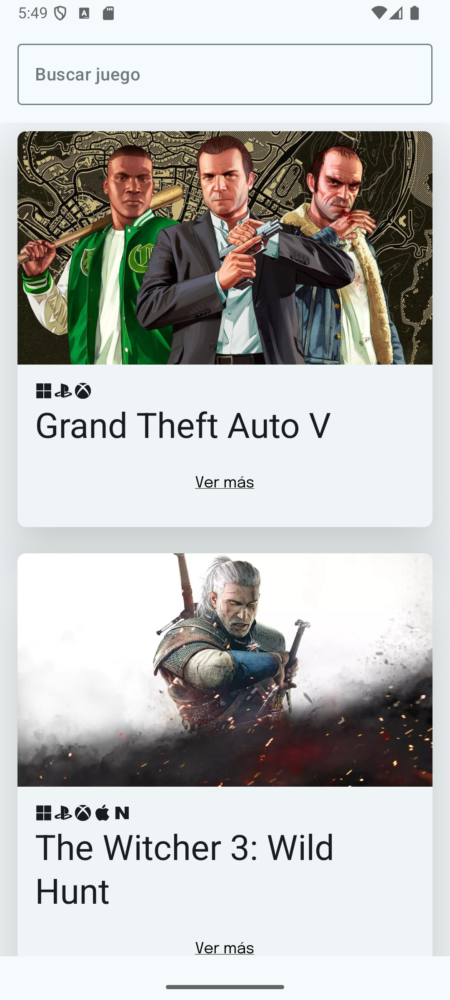
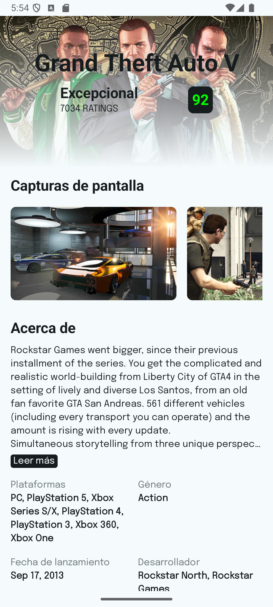
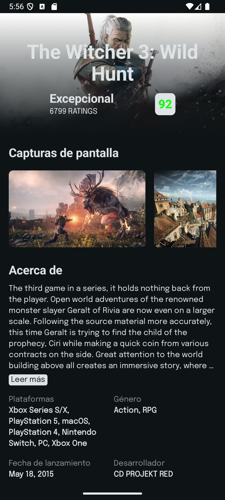
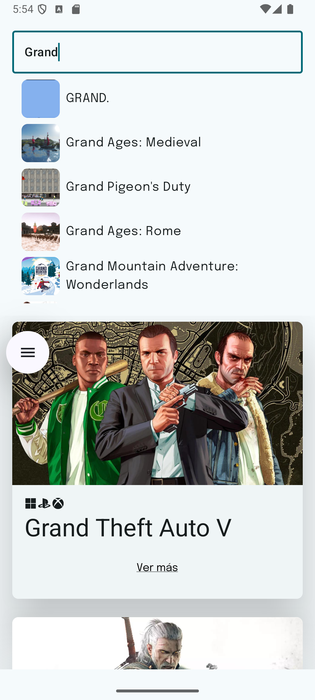
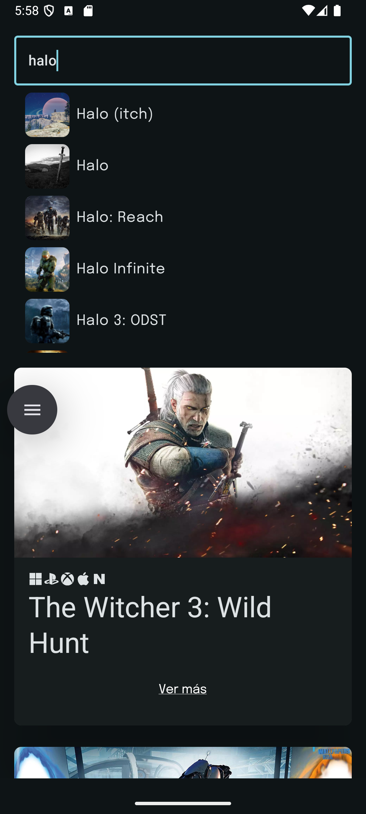

# GamesLib
**GamesLib** es una aplicación móvil que te permite explorar, buscar y ver detalles de videojuegos, incluyendo sus puntajes Metascore, utilizando la API de **RAWG.io**.

# Características
* **Explora juegos**: Obtén una lista de los videojuegos más populares.
* **Búsqueda**: Encuentra juegos por su nombre.
* **Detalles del juego**: Visualiza información detallada como la descripción, fecha de lanzamiento, desarrolladores y calificaciones.
* **Interfaz adaptable**: Compatible con dispositivos móviles y tablets gracias al uso de **Jetpack Compose**.

# Capturas de pantalla
<table>
  <tr>
    <td align="center">
      
       <b>Pantalla principal - Light Mode</b>
    </td>
    <td align="center">
      
       <b>Pantalla principal - Dark Mode</b>
    </td>
  </tr>
  <tr>
    <td align="center">
      
       <b>Pantalla de detalles - Light Mode</b>
    </td>
    <td align="center">
      
       <b>Pantalla de detalles - Dark Mode</b>
    </td>
  </tr>
  <tr>
    <td align="center">
      
       <b>Buscador - Light Mode</b>
    </td>
    <td align="center">
      
       <b>Buscador - Dark Mode</b>
    </td>
  </tr>
  <tr>
    <td align="center">
      
       <b>Diseño en tablets y celulares plegables - Light Mode</b>
    </td>
    <td align="center">
      
       <b>Diseño en tablets y celulares plegables - Dark Mode</b>
    </td>
  </tr>
</table>

# Tecnologías y Librerías
* **Kotlin**: Lenguaje principal.
* **Jetpack Compose**: Para la interfaz de usuario.
* **MVVM**: Arquitectura del proyecto.
* **ViewModel**: Para manejar los datos y el estado de la UI.
* **Ktor**: Framework ligero para realizar las peticiones HTTP de forma asíncrona.
* **Koin**: Librería para la inyección de dependencias.
* **Desugar**: Herramienta que permite usar características modernas de Java en versiones anteriores de Android.
* **Coil**: Librería para carga y manejo eficiente de imágenes.

# API
Esta aplicación utiliza la API de **RAWG.io** para obtener datos de videojuegos. Consulta la documentación oficial [aquí](https://api.rawg.io/docs/).

# Licencia
Este proyecto está licenciado bajo la Licencia MIT. Consulta el archivo [LICENSE](https://choosealicense.com/licenses/mit/) para más información.

# Contacto
Para preguntas o sugerencias, contáctame a través de:
- Email: [whgarcia.dev@gmail.com](mailto:whgarcia.dev@gmail.com)
- GitHub: [WiliamGarcia814](https://github.com/WiliamGarcia814)